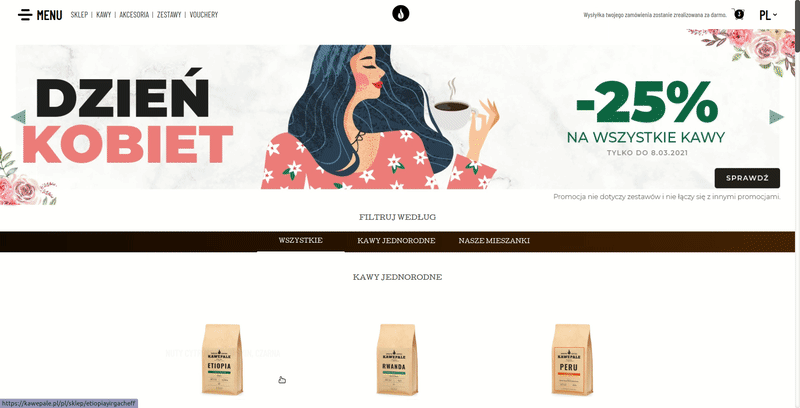

import { UI, GridGallery } from '../components/uxui.jsx';

## UX / UI

KawePale is a long supported project of mine I have been developing since 2018 now, 
is is a full package combination, business website, blog and e-commerce solution. 

The main business goal of the website is to promote and sell high end coffee and coffee related products.
KawePale are 2 passionate guys about importing, roasting and distributing the best coffee in Warsaw.
In the design I wanted to express that feeling of personal touch and combine it with clean and professional minimalistic look. 

This platform was and is in constant development with clear goal to increase conversion rates on actual shopping and brand build.
Google analytics metrics with extended custom event e-commerce tracking is a good tool in refactoring UI to fit customer needs. 

<UI colors={['#0c0c0c', '#373739', '#737373' ,'#aaa5a5', '#f90000']} 
    primeFontFamily={'Barlow Condensed'} 
    secondaryFontFamily={'Cutive'} 
    background={'#FFF'}
    textColor='#4a4a4a' 
    h1={{
          marginTop: '150px',
          fontFamily: 'Barlow Condensed,sans-serif',
          fontWeight: '700',
          fontSize: '40px',
          textTransform: 'uppercase',
          color: '#000'
        }} 
    h2={{
      fontSize: '35px',
      fontWeight: '700',
      fontFamily: 'Barlow Condensed, sans-serif',
    }}
    body={{
      fontFamily: 'Cutive',
      color: '#363636',
      fontSize: '18px',
      lineHeight: 1.5,
    }}
        />

  

### Development

kawepale.pl is one of the most demanding projects I have encountered so far, internationalization with 7 languages, multi lang blog 
platform, shopping solution, custom payment integration and custom voucher creation was only a few of client's demands. 

For the backend and blog side of things I have entrusted the good old wordpress to do the job for me, as its build-in solutions were 
everything I needed to spawn the requirements quickly. On the front-side I have chosen the battle tested gatbsy.js 
framework. Gatsby is great for SEO and static frontside which scales easily. 

Website is live and operating, if in need of good coffee please check out [kawepale.pl](https://kawepale.pl)

Designed and developed by spaceout.pl