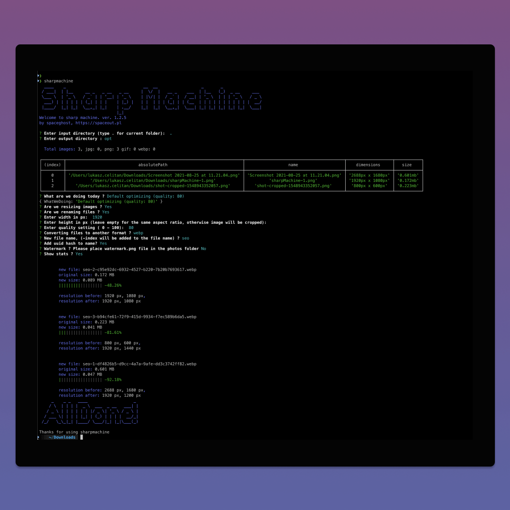

# Sharp Machine

During my intial years of development, much of my time, I have spent on frontend and frontend optimalizastions.
One of those things I had to constaly do was to optimize images for web use, I had to do a upload a lot of pictures manually via backend server.
Image optimalizastions are considred one of the most important step in website optimalizastion, after all
one unoptimized image can weight 16 x as much as the website bundle, and we were also checed on the google page speed insights.

The idea for a cli optimizing came to me as obvious choice, and so the shapmachine was born.
Sharp Machine is an image optimizing program cli meant to be installed globally. After execution Sharp Machine will scan for images and optimize them according to config set up via interactive cli.
You can resize, crop and force format and edit whole sharp module config (will open your fav editor) via cli command.
Uses sharp npm module as base for image manipulation.

Sharpmachine was the the second project I considred publishing to npm. I try to keep it up to date. Sometime aga I have also rewritten it into typescript.
Making your own cli tool was definetly fun, a lot of ASCII and raw command console work. A great idea into getting more into interacting more with the OS rather then the user.



link to npm: https://www.npmjs.com/package/sharpmachine

## Installation

```sh
npm i -g sharpmachine
```

## Run sharp machine

Navigate to a folder with images and run

```sh
sharpmachine
```

                                |_|

1. Either type folder name, or type "." for current folder (required)
2. Enter output folder (required)

## Commands

If selected folder contains images (png, jpg, gif, webp), you can :

1. Optimize images with default config; Images will optimized with 80 quality, unless specified via cli, the images will not be resized.

2. Optimize images to webp format with default config; Images will optimized with 80 quality, unless specified via cli, the images will not be resized.

For both options cli will ask for resizing options, if specified yes, cli will demand width (number: required), height (number: leave empty to keep the aspect ration) and image quality (0 - 100)

3. Custom Config; custom config option will open your favorite text editor, where global sharp image config resides:

```
 {
    "quality":90,
    "rotate":false,
    "trim":false,
    "jpegQuality":90,
    "pngQuality":90,
    "webpQuality":90,
    "jpegProgressive":true,
    "cropFocus":"left top",
    "width":false,
    "height":false,
    "pngCompressionLevel":9,
    "pngCompressionSpeed":4,
    "toFormat":"",
    "useMozJpeg":false
 }

```

edit, save and quit

Configuration options and types can be found at: https://sharp.pixelplumbing.com/en/stable/api-operation/

4. Show Stats (yes/no) Shows simple statistics on executed files. (Slower)

5. Add watermark to images, cli will ask for watermark addition, in order to make this work put watermark.png into input folder. Sharpmachine will add the watermark image in the bottom right corner, please note that watermark should be smaller than the pictures you are optimizing

## Contribution

All requests are more than welcome

## ToDo

- Select files from the list
- Improve progress bars
- Improve verbose statistics

## License:

Type: ISC

Author: Lukasz Celitan, "Spaceghost", https://spaceout.pl, info@spaceout.pl
Sourcecode: [github](https://github.com/MassivDash/SharpMachine)
