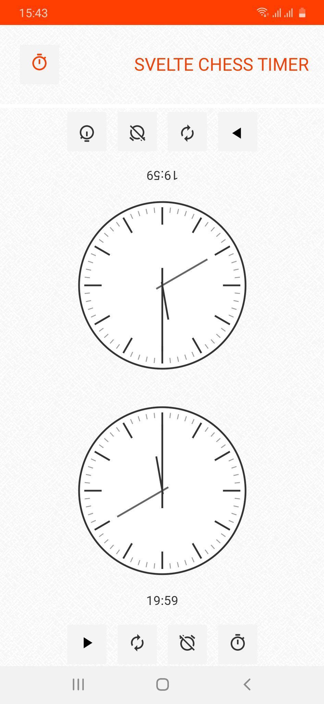
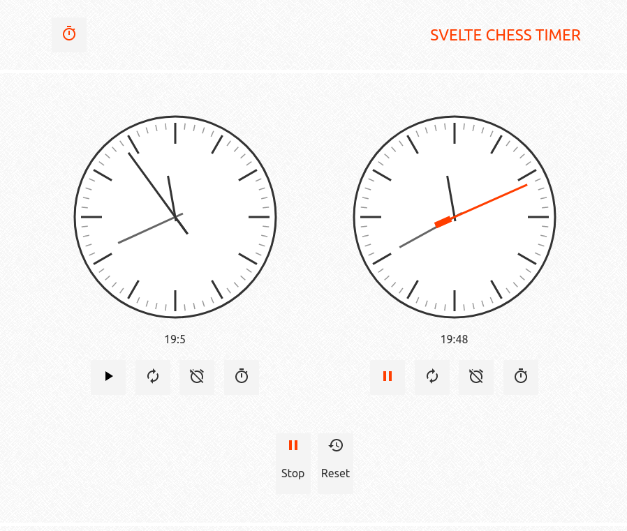

import { UI, GridGallery } from '../components/uxui.jsx';

## UX / UI

<UI
  colors={['#0c0c0c', '#52525b', '#d4d4d8', '#fbfbfb', '#aaa5a5']}
  primeFontFamily={'Lato'}
  secondaryFontFamily={'Cormorant'}
  background={'#FFF'}
  textColor="#0c0c0c"
  h1={{
    fontFamily: 'Cormorant',
    fontWeight: '700',
    fontSize: '40px',
    textTransform: 'uppercase',
    color: '#0c0c0c',
  }}
  h2={{
    fontSize: '35px',
    fontWeight: '700',
    fontFamily: 'Lato',
  }}
  body={{
    fontFamily: 'Lato',
    color: '#0c0c0c',
    fontSize: '18px',
    lineHeight: 1.7,
  }}
/>

## Overview

Svelte chess timer is a simple app written in the [Sevlte framework](https://svelte.dev/) . This fully operational chess timer clock, will track opponents times in the traditional way of counting down to midnight. The old switch-eru button lets you rotate the timer, great option if you are really plan on using it. Don't forget to switch on the alarm next to your timer, for the buzzer at the end of time limit

Svelte Chess Timer Source code at [github](https://github.com/MassivDash/Svelte-Chess-Timer) , moving clock svg component by [svelte team](https://svelte.dev/examples#clock)

## Implmenting progressive web app

The timer is a perfect scenario for applying the pwa features. It is a small app, that can be used offline, and has a great user experience. This way you can play chess with a friend offline whenever the time is right. Svelte framework has already ready made pwa plugins so converting the application to a pwa was quite easy. More info about pwa in svelte can be found [here](https://web.dev/learn/pwa/installation)

Timer at [https://chess-timer.spaceout.pl/](https://chess-timer.spaceout.pl/)
