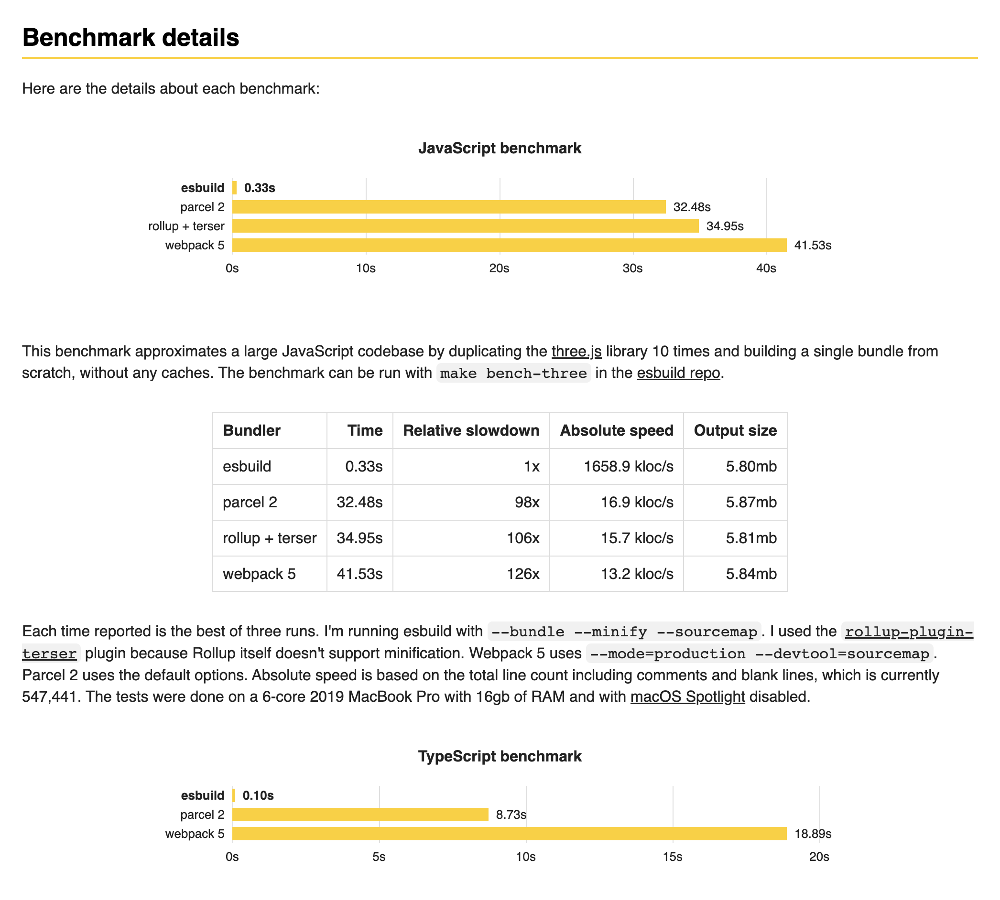

  
  
  

# Esbuild template with typescript, react, and tailwindcss

## Introduction

I've have been working with webpack for a very long time now, I am still using
this solution for any proffesional (job) projects in my current employment, the
fine grain control it gives its a very fundmanetal for web development process.

That being said, webpack with each iteration, with each new feature, niche bug
fix is becoming slower and slower. You can definetly see this in large
monolithic projects using typescript. Some time ago I have come across a
[esbuild bundler](https://esbuild.github.io/), the author promises to make
webpack and other bundlers obsolete but is true ?

In reality esbuild is way faster than webpack, but less stable and less
developed ecosystem around the bundler. It's biggest tradeoff and source of
speed is dropping the es5 support, it only supports bundeling with es6 therefore
targeting the modern browsers.

While constructing this template I have challanged myself to fully recrate the
standard webpack development cycle, with linters, typescript and hot module
reloading. The hot module replacement was the main deal breaker for me, esbuild
can rebuild the entire package fast, but there is no out of the box solution for
hot relead, the devloper is forced to hit the refresh button on each file
change. Since that is a big no go, in my opinion, the hot module replacement is
the most important feature of the bundler setup. With pure esbuild (and not
wanting anything from the webpack family), I was forced to look for some other
solutions, unfortunately there are not many projects like this as
webpack-dev-server seems to be a primary solution for this problem.

The truth is that the webpack ecosytem and stableness far outweighs the speed of
esbuild. Hopefully with time the esbuild ecosystem will rise enough to provide
the standard of DX that all the developers have currently with other more
proffesional open source bundlers or frameworks.

You can get more info on esbuild
[here](https://esbuild.github.io/faq/#why-is-esbuild-fast)

## Starter kit

React and Node.js template with esbuild, typescript, jest, testing libary,
tailwind React and Node.js and Typescript with only esbuild packages, starter is
still experimental however fully functional. Since i opted to drop all webpack
and webpack family related packages the process of hooking up some kind of live
reload proved to be the most difficult to achieve. Project uses "servor"
package, it has a longer booting time than webpack-dev-server

includes

- Server (express)
- Static React app with live reload
- Tailwind css (postCSS, Autoprefixer)
- Jest / react testing library
- Typescript
- Eslint, husky,

## 🤝 Contributing

Contributions, issues and feature requests are welcome! Feel free to check
in out on
[github](https://github.com/MassivDash/typescript-react-express-esbuild/).

## Show your support

Give a ⭐️ if this project helped you!
