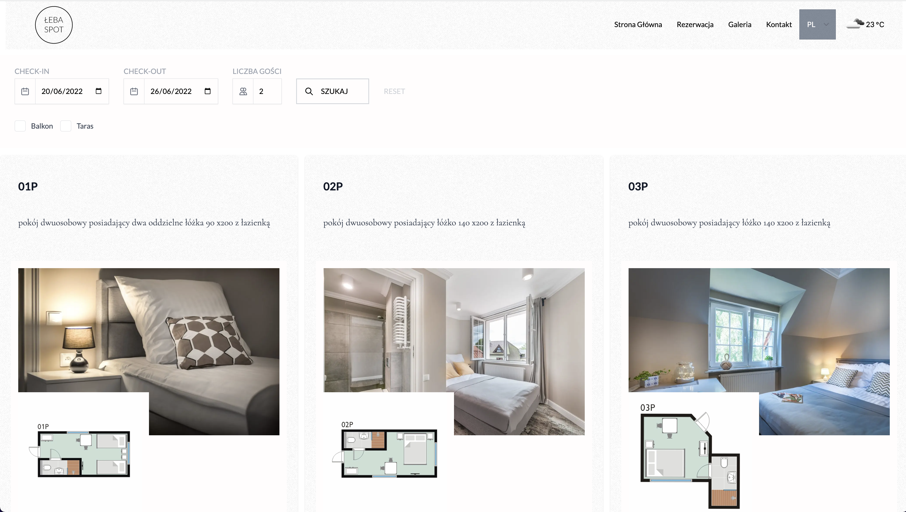
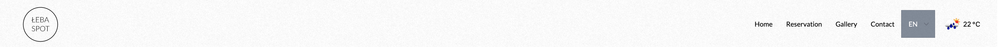

import { UI, GridGallery } from '../components/uxui.jsx';

## Ux/Ui

This website has started out as a custom wordpress theme and wp installation,
however as the seasons went by, I have decided to move the project to the
next.js installation. It seemed as the right combintion between static pages and
dynamic pages that require connection to various 3rd party APIs (like
booking.com). The obvious business requirements was creating a room reservation
system that will not allow overbooking, double booking and a responsive admin
panel so the owners can have control over their reservations whenever they want.
The website also had to contain diffrent languages versions, in order to widen
the audience of this mini hotel. The seo was a also a big factor in this build.

The design changed over the years, but in the end I have decieded upon a subtle
elegant look in shades of black, grey and white. Lato (Sans Serif, did you know
? "Lato" means summer in polish) and Cormorant (Serif) fonts are being utilized
as the main duo of typography set up. Thankfully owners could come up with Hotel
pictures that mathed the tone of the website.

<UI
  colors={['#0c0c0c', '#52525b', '#d4d4d8', '#fbfbfb', '#aaa5a5']}
  primeFontFamily={'Lato'}
  secondaryFontFamily={'Cormorant'}
  background={'#FFF'}
  textColor="#0c0c0c"
  h1={{
    fontFamily: 'Cormorant',
    fontWeight: '700',
    fontSize: '40px',
    textTransform: 'uppercase',
    color: '#0c0c0c',
  }}
  h2={{
    fontSize: '35px',
    fontWeight: '700',
    fontFamily: 'Lato',
  }}
  body={{
    fontFamily: 'Lato',
    color: '#0c0c0c',
    fontSize: '18px',
    lineHeight: 1.7,
  }}
/>

I have also decided to inlude current wheater api call so the user can see what
he is actually missing. A fine detail that hopefully users can appreciate. I
think it ties in nicley with the navbar and language picker, making a less
borking but yest standard navbar.

Other non standard but very important elements were the searchbar with filters
and reservation calendar picker. The search back was constructed as sticky
element that show it self on scroll back, optimising user room reservation
search for the user. A custom calendar picker had also to be constructed bin
order to show hafl booked days.

## Developent: next.js, postgres, tailwindcss

Next.js is a framework that allows you to create a single page application. It
is a lot more flexible than wordpress that helped me tie custom business rules
with mentioned 3rd api intergartions. For this next.js dynamic and api
capabielities were used, the next.js helps on this end a lot, providing also the
in-house image optimalizastions features on the server side.

I have used the postgres database as the main backend database. Its a solid
choice for verstile and scalable sql data storage.

On this project I have used the React and tailwindcss framework to create a
responsive customer website and admin panel. I became quite fond of the
tailwindcss framework as it is a great tool for quickly building responisve
designs and achive great performance on css performance and overall bundle.
Definately a framework I plan to keep on using.

Overall next.js is a great React framework for building a single page
applications, however it is not without it faults. Rapid developement of next.js
can bring troubles as core upgrades bring often many breaking changes and other
bugs to already established instance.

## Lebaspot.com.pl is a bed and breakfast property located by the polish bałtyk sea.

👉 https://lebaspot.com.pl
