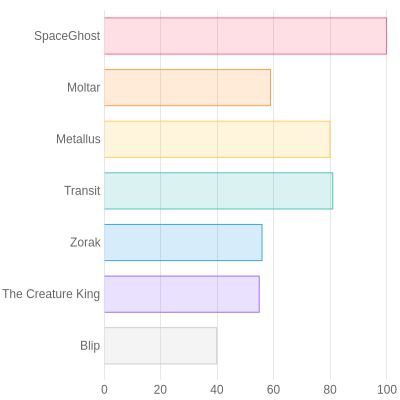

## Introduction

The so-called "Serverless" technology was introduced by AWS with their Lambda
service, and Azure quickly followed suit with their own rendition, Azure
Functions. Azure Functions is an excellent way to run small pieces of code in
the cloud without having to worry about the underlying infrastructure. Here is a
quick guide on how to create Azure Functions using TypeScript.

## Azure Functions v4

Azure Functions v4 is the latest version of Azure Functions. In addition to many
languages supported by Azure Functions including C#, JavaScript, Java, Python,
and PowerShell, Azure Functions v4 has added support for TypeScript.

The almost native support for TypeScript in Azure Functions v4 is a great
addition, as it's included in the development runtime, CLI commands, and
templates. In the JavaScript version, users have to add those cumbersome binding
JSONs, but this isn't necessary in the TypeScript version. Unfortunately, the
underlying Func engine (Azure Core Tools) does not support custom path aliases
(@utils) in the tsconfig.json, a feature beloved by TypeScript developers.

## The Serverless use cases

Back in the day, when serverless was starting to gain serious hype, dreams of
automatic upscaling went wild. Despite Azure Functions clearly defining its
purpose, some people started using them as a replacement for traditional web
servers. It became quickly evident that the costs for functions were higher than
containers or VMs.

- Azure Functions are exceptional for small pieces of code that are triggered by
  events.
- They're also an excellent solution for moving interfaces and functions that
  are significant bottlenecks for the main application.
- They can circumvent current limitations of the main application by creating a
  new function that performs tasks incompatible with the main server, or when
  changes to the system are costly or risky.

## Development

We are obviously working with Node.js here, making the development fairly
straightforward. The func CLI tool, part of the
[Azure Core Tools](https://www.npmjs.com/package/azure-functions-core-tools), is
used to create the functions.

The actual SDK package is
[@azure/functions](https://www.npmjs.com/package/@azure/functions), which is
used to create the functions and handle requests.

The Node.js "programming model" should not be confused with the Azure Functions
"runtime". The programming model defines how you author your code and is
specific to JavaScript/TypeScript. The runtime defines the underlying behavior
of Azure Functions and is shared across all languages. The programming model
version is tied firmly to the version of the @azure/functions npm package, and
is versioned independently from the runtime.

Unfortunately, both the runtime and the programming model are on "4" as their
latest major version, but this is purely coincidental. You cannot mix the v3 and
v4 programming models in the same function app. As soon as you register one v4
function in your app, any v3 functions registered in function.json files are
ignored.

## Chart to image function

My Azure Function example/template is an HTTP trigger function that creates a
PNG based on the node-canvas package given specific request parameters.

Recently, I was tasked with proving a concept for a chart to image conversion.
My main application's current stack was having a hard time accepting
Canvas-node, known for its difficult installation\*. Azure Function seemed like
an elegant solution for this problem.

\*This is a subjective opinion based on the node-canvas issues on the GitHub
repo.

As usual, I added much-needed development tools such as ESLint, Prettier, Husky,
and Commitlint for proper code quality maintenance. Additionally, I added the
Vitest test for unit and integration testing.

You can see a full github repo example
[here](https://github.com/MassivDash/chart2img)

```ts
import {
  app,
  HttpRequest,
  HttpResponseInit,
  InvocationContext,
} from '@azure/functions';

import { extractColors, createCanvas } from '../utils';
import { barChartOptions } from '../charts';
import { Chart, ChartConfiguration, ChartItem, Plugin } from 'chart.js/auto';

export async function barChart(
  request: HttpRequest,
  context: InvocationContext,
): Promise<HttpResponseInit> {
  try {
    context.log(`Http function processed request for url "${request.url}"`);

    const { canvas, ctx } = createCanvas(400, 400);

    const plugin: Plugin = {
      id: 'customCanvasBackgroundColor',
      beforeDraw: (chart, _args, options) => {
        const { ctx } = chart;
        ctx.save();
        ctx.globalCompositeOperation = 'destination-over';
        ctx.fillStyle = options.color || '#99ffff';
        ctx.fillRect(0, 0, chart.width, chart.height);
        ctx.restore();
      },
    };

    const plugins = [plugin];

    const labels = request.query.get('labels')?.split(',');
    const dataValues = request.query.get('data')?.split(',').map(Number);

    if (
      !labels ||
      labels.length === 0 ||
      !dataValues ||
      dataValues.length === 0
    ) {
      throw new Error('Unable to create');
    }

    const backgroundColorsRaw = request.query.get('backgroundColors');
    const borderColorsRaw = request.query.get('borderColors');

    const backgroundColors = extractColors(backgroundColorsRaw);
    const borderColors = extractColors(borderColorsRaw);
    const data = {
      labels: labels,
      datasets: [
        {
          label: 'My First Dataset',
          data: dataValues,
          backgroundColor: backgroundColors,
          borderColor: borderColors,
          borderWidth: 1,
        },
      ],
    };

    const chartConfig = {
      type: 'bar',
      data: data,
      options: barChartOptions,
      plugins,
    };

    new Chart(ctx as unknown as ChartItem, chartConfig as ChartConfiguration);

    const pngBuffer = canvas.toBuffer('image/png');

    // Set the headers and send the PNG buffer in the response
    request.headers.set('Content-Type', 'image/png');
    request.headers.set('Content-Length', pngBuffer.length.toString());
    return {
      status: 200,
      body: pngBuffer,
      headers: request.headers,
    };
  } catch (error) {
    context.log(error);
    return {
      status: 500,
      body: 'Internal server error',
    };
  }
}

app.http('barChart', {
  methods: ['GET', 'POST'],
  authLevel: 'anonymous',
  handler: barChart,
});
```

This function expects almost all data to come in the query parameters, and it
dynamically creates the bar chart image. When calling the function, labels,
data, background, and border colors must be supplied.

```bash
https://spacechart.azurewebsites.net/api/barChart?labels=SpaceGhost,Moltar,Metallus,Transit,Zorak,The%20Creature%20King,Blip&data=100,59,80,81,56,55,40&backgroundColors=rgba(255,%2099,%20132,%200.2),rgba(255,%20159,%2064,%200.2),rgba(255,%20205,%2086,%200.2),rgba(75,%20192,%20192,%200.2),rgba(54,%20162,%20235,%200.2),rgba(153,%20102,%20255,%200.2),rgba(201,%20203,%20207,%200.2)&borderColors=rgb(255,%2099,%20132),rgb(255,%20159,%2064),rgb(255,%20205,%2086),rgb(75,%20192,%20192),rgb(54,%20162,%20235),rgb(153,%20102,%20255),rgb(201,%20203,%20207)
```

The final result is a simple bar chart image that can be downloaded or used in
applications, emails, or other mediums that might work better with images.



## Conclusion

In summary, serverless functions like Azure Functions have surfaced as
innovative solutions that offer a different perspective to addressing common
problems in scaling and software compatibility. As showcased by the example
above, serverless functions can tackle specific tasks that might not be feasible
or efficient within a primary application's context.

The advent of AWS's Lambda service marked the beginning of a new era of
serverless computing, and the technology was soon embraced by Azure in the form
of Azure Functions. This new technology was appealing as it allowed small code
pieces to be executed in the cloud without worrying about managing the
underlying infrastructure. Whatever Azure lacks in first-mover advantage, it
tries to compensate with new features and support for a wide array of languages,
notably recently introducing TypeScript support.

However, serverless computing comes with its unique challenges and
misconceptions. Despite their seemingly endless benefits, Azure Functions or its
equivalents are not the ultimate solution to every problem—they cannot and
should not replace traditional web servers entirely. It's crucial to understand
that even though serverless functions can auto-scale, their costs can exceed
those of containers or VMs, which can be surprising and detrimental for
uncritical adopters.

Instead, serverless functions excel when applied to small tasks, driven by
events. They also function well when moving interfaces and tasks that weigh
heavily on the primary application, allowing for improved overall performance.
They can also serve as a perfect solution to address compatibility issues,
circumventing limitations present within the primary application by offering a
platform to build functions that can carry out tasks that the main server is
incompatible with.

To conclude, serverless functions, along with exciting emerging technological
advances in the industry, should be seen as beneficial tools within a
developer's toolbox. However, like any tool, their adoption should be based on
needs, feasibility, and context. A careful understanding of their use cases,
costs, advantages, and disadvantages is mandatory for making an informed choice
about when and how to use Azure Functions or any serverless technology. It is
essential to remember that advancements in technology inevitably come with their
own set of challenges, and serverless functions are no exception. Therefore,
they should be approached with caution, critical evaluation, and a readiness to
adapt and learn.
