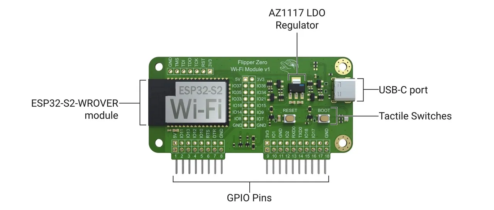

## Project Overview 

Hey there, fellow tinkerers and security enthusiasts! SpaceGhost here, and I've got an exciting project to share with you. My recent adventures with Flipper device programming have led me down another fascinating rabbit hole. This time, I've embarked on a mission to bring network capabilities to the Flipper Zero by developing custom firmware for the official ESP32 chip board.


*Image source: https://docs.flipper.net/development/hardware/wifi-developer-board/schematics*

## The Power of ESP32

Before we dive into the project details, let's take a moment to appreciate the ESP32 chip. Developed by Espressif Systems, this little powerhouse has become a favorite in the IoT and embedded systems world. Here's a quick rundown of its impressive capabilities:

- Dual-core processor running at up to 240 MHz
- Wi-Fi and Bluetooth connectivity
- Robust security features
- A plethora of peripherals and interfaces
- Low power modes for energy-efficient operation
- Extensive development support

With these features, the ESP32 is perfectly suited for our goal of enhancing the Flipper Zero's capabilities.

## Project: Flipper Postman ESP32-S2

Our project, which I've dubbed "Flipper Postman ESP32-S2," aims to create custom flash software for the Flipper Dev Board. This software exposes WiFi and HTTP methods via serial (UART), allowing the Flipper Zero to pick them up and build web-enabled applications.

### Key Features

- WiFi network management (connect, disconnect, list networks)
- HTTP requests (GET, POST, PATCH, STREAM)
- Custom HTTP request builder
- UDP communication
- LED indicators for various states

### How It Works

The custom firmware acts as a bridge between the Flipper Zero and the internet. Here's a simplified workflow:

1. Flash the custom firmware onto the ESP32-S2 board.
2. Connect the board to the Flipper Zero.
3. Use UART commands to control WiFi connections and make HTTP requests.
4. The ESP32-S2 handles the network operations and returns the results to the Flipper Zero.

This setup essentially turns your Flipper Zero into a pocket-sized web client, opening up a world of possibilities for security testing, IoT experimentation, and more.

## Potential Applications

With this new capability, we can explore several exciting avenues:

1. **WiFi Penetration Testing**: Create portable tools for network scanning, deauthentication attacks, and security audits.

2. **IoT Device Emulation**: Simulate various IoT devices to test network security or set up honeypots.

3. **Remote Control and Monitoring**: Implement web interfaces or mobile apps to control your Flipper Zero remotely.

4. **Mesh Networking**: Develop networks of multiple Flipper devices for distributed tasks or long-range communication.

5. **Signal Processing and SDR**: Implement basic software-defined radio functionalities or create spectrum analyzers.

6. **Network Protocol Analysis**: Build portable packet sniffers, protocol analyzers, and debugging tools.

7. **Environmental Sensing**: Integrate various sensors for portable weather stations or environmental monitoring.


## Project Information

[Github repo](https://github.com/MassivDash/flipper-postman-esp32s2)

Custom flash software for Flipper Dev Board exposing the WIFI and HTTP methods via serial (UART) that can be picked up by the flipper zero device for building web enabled applications.


## Features

- Connect / Disonnect to WiFi networks
- List available WiFi networks
- Make HTTP GET, POST, PATCH and STREAM requests
- Custom HTTP request builder with all the methods GET, POST, HEAD, DELETE, PATCH, PUT, attach custom headers (Authorization), show and hide response headers
- Stream serial responses for large payloads.
- UDP communication, send commands and messages over the network via UDP packets
- LED indicators for different states

## UDP / Network communication

After you establish wifi the board listens to UDP packets you can use mobile apps (with TCP/UDP) or use cmd line tools like `echo -n "GET https://api.spacexdata.com/v3/rockets" | nc -u 192.168.0.115 1234`.

The board will transmit the local port and into the serial

You can also send custom messages to the flipper, type MESSAGE: {your text} for transmitting whatever you want to your flipper device.

## Flipper Zero Uart Terminal

You can use the https://github.com/cool4uma/UART_Terminal to communicate directly with the board. You don't have to write `https://` it will be auto added by the board.


## Arduino Ide Serial Monitor

Communication via usb to flipperzero (GPIO->USB-UART Bridge) with Arduino Ide Serial Monitor


## Installation (Build from source)

0. Git clone the project
1. Install [Arduino IDE](https://www.arduino.cc/en/software)
2. Arduino IDE -> Settings (Preferences)

Copy and paste the `https://raw.githubusercontent.com/espressif/arduino-esp32/gh-pages/package_esp32_index.json`

3. Wait for installation
4. Arduino IDE -> Tools -> Board -> Board Manager -> look for `esp32 by Expressif systems` and install
5. Arduino IDE -> Tools -> Manage Libraries -> find ArduinoJSON package and install
6. Arduino IDE -> Select Board -> choose esp32s2 dev board

[UART Terminal Application](https://github.com/cool4uma/UART_Terminal). You can also connect flipper to your computer via usb cable then enter GPIO and enable the UART-USB Bridge to communicate directly to board via Arduino IDE Serial Monitor or [minicom](https://wiki.emacinc.com/wiki/Getting_Started_With_Minicom) cmd line program

7. Set the SSID and password for the WiFi connection using the `SET_SSID` and `SET_PASSWORD` commands.
8. Activate the WiFi connection using the `ACTIVATE_WIFI` command.
9. Use the `GET`, `POST`, or `GET_STREAM` commands to make HTTP requests.
10. Build custom HTTP requests using the `BUILD_HTTP_*` commands.
11. Execute custom HTTP requests using the `EXECUTE_HTTP_CALL` command.
12. Use the `?` or `HELP` commands to print help information.

## SERIAL API Documentation

This section provides detailed information about the available commands, their descriptions, arguments, responses, and response types. It also includes the possible serial responses that the receiver can expect.

### Commands

| Command                                         | Description                                       | Arguments                           | Response Type | Response Description                                                                                    |
| ----------------------------------------------- | ------------------------------------------------- | ----------------------------------- | ------------- | ------------------------------------------------------------------------------------------------------- |
| `VERSION`                                       | Get board version                                 | None                                | Text          | `VERSION: <version>`                                                                                    |
| `WIFI_CONNECT <SSID> <password>`                | Connect to a WiFi network                         | `<SSID> <password>`                 | Text          | `WIFI_SSID: <SSID><br>WIFI_PASSWORD: <password><br>WIFI_CONNECT: Connecting to WiFi...`                 |
| `WIFI_SET_SSID <ssid>`                          | Set the SSID for WiFi connection                  | `<ssid>`                            | Text          | `WIFI_SSID: <ssid>`                                                                                     |
| `WIFI_SET_PASSWORD <password>`                  | Set the password for WiFi connection              | `<password>`                        | Text          | `WIFI_PASSWORD: <password>`                                                                             |
| `WIFI_ACTIVATE`                                 | Activate the WiFi connection                      | None                                | Text          | `WIFI_CONNECT: Connecting to WiFi...`                                                                   |
| `WIFI_DEACTIVATE`                               | Disconnect from the WiFi network                  | None                                | Text          | `WIFI_DISCONNECT: Wifi disconnected`                                                                    |
| `WIFI_LIST`                                     | List available WiFi networks                      | None                                | Text          | `WIFI_LIST: <list>`                                                                                     |
| `WIFI_STATUS`                                   | Show WiFi status                                  | None                                | Text          | `WIFI_STATUS: CONNECTED` or `WIFI_STATUS: DISCONNECTED`                                                 |
| `WIFI_GET_ACTIVE_SSID`                          | Get the name of the connected SSID                | None                                | Text          | `WIFI_GET_ACTIVE_SSID: <ssid>` or `WIFI_GET_ACTIVE_SSID: Not connected`                                 |
| `WIFI_GET_LOCAL_IP`                             | Get the local IP address                          | None                                | Text          | `<ip_address>`                                                                                          |
| `GET <url>`                                     | Make an HTTP GET request                          | `<url>`                             | Text          | `GET: <url><br>STATUS: <number><br>RESPONSE:<br><response><br>RESPONSE_END`                             |
| `GET_STREAM <url>`                              | Make an HTTP GET request and stream the response  | `<url>`                             | Stream        | `GET_STREAM: <url><br>STATUS: <number><br>STREAM: <br><streamed data><br>STREAM_END`                    |
| `FILE_STREAM <url>`                             | Direct stream, no messages                        | `<url>`                             | Text          | `<stream>`                                                                                              |
| `POST <url> <json_payload>`                     | Make an HTTP POST request with JSON payload       | `<url> <json_payload>`              | Text          | `POST: <url><br>Payload: <json_payload><br>STATUS: <number><br>RESPONSE:<br><response><br>RESPONSE_END` |
| `POST_STREAM <url> <json_payload>`              | Make an HTTP POST request and stream the response | `<url> <json_payload>`              | Stream        | `POST_STREAM: <url><br>STATUS: <number><br>STREAM: <br><streamed data><br>STREAM_END`                   |
| `BUILD_HTTP_METHOD <method>`                    | Set the HTTP method for custom request            | `<method>`                          | Text          | `HTTP_SET_METHOD: <method>`                                                                             |
| `BUILD_HTTP_URL <url>`                          | Set the URL for custom HTTP request               | `<url>`                             | Text          | `HTTP_URL: <url>`                                                                                       |
| `BUILD_HTTP_HEADER <key:value>`                 | Add a header to custom HTTP request               | `<key:value>`                       | Text          | `HTTP_ADD_HEADER: <key:value>`                                                                          |
| `BUILD_HTTP_PAYLOAD <payload>`                  | Set the payload for custom HTTP request           | `<payload>`                         | Text          | `HTTP_SET_PAYLOAD: <payload>`                                                                           |
| `REMOVE_HTTP_HEADER <key>`                      | Remove a header from custom HTTP request          | `<key>`                             | Text          | `HTTP_REMOVE_HEADER: <key>`                                                                             |
| `RESET_HTTP_CONFIG`                             | Reset custom HTTP request configuration           | None                                | Text          | `HTTP_CONFIG_RESET: All configurations reset`                                                           |
| `BUILD_HTTP_SHOW_RESPONSE_HEADERS <true/false>` | Show or hide HTTP response headers                | `<true/false>`                      | Text          | `HTTP_BUILDER_SHOW_RESPONSE_HEADERS: <true/false>`                                                      |
| `BUILD_HTTP_IMPLEMENTATION <STREAM/CALL>`       | Set HTTP implementation type                      | `<STREAM/CALL>`                     | Text          | `HTTP_SET_IMPLEMENTATION: <STREAM/CALL>`                                                                |
| `EXECUTE_HTTP_CALL`                             | Execute the custom HTTP request                   | None                                | Text/Stream   | Depends on implementation type                                                                          |
| `BUILD_HTTP_SHOW_CONFIG`                        | Show current HTTP configuration                   | None                                | Text          | `HTTP_BUILDER_CONFIG: <current configuration>`                                                          |
| `MESSAGE_UDP <message> <remoteIP> <remotePort>` | Send UDP message                                  | `<message> <remoteIP> <remotePort>` | Text          | `UDP message sent: <message><br>To IP: <remoteIP>, Port: <remotePort>`                                  |
| `?`                                             | Print help information                            | None                                | Text          | `Available Commands: <list of commands>`                                                                |
| `HELP`                                          | Print help information                            | None                                | Text          | `Available Commands: <list of commands>`                                                                |

#### Sending Commands

To set the SSID for the WiFi connection:

```plaintext
SET_SSID MyWiFiNetwork
```

To make an HTTP GET request:

```plaintext
GET https://api.example.com/data
```

To make an HTTP GET request and stream the response:

```plaintext
GET_STREAM https://api.example.com/data
```

To make an HTTP POST request with a JSON payload:

```plaintext
POST https://api.example.com/data {"key":"value"}
```

## HTTP Builder

The firmware holds a http config you can manipulate and then execute the call.
Check the flags in the table above.

#### Show response headers

HTTP builder if set for showing headers will only transmit the headers from this list `"Content-Type", "Content-Length", "Connection",
                                "Date", "Server"`

#### Simple Build call

BUILD_HTTP_METHOD HEAD
BUILD_HTTP_URL https://api.com/
EXECUTE_HTTP_CALL

#### Receiving Responses

When you send a `GET_STREAM` command, you will receive the following responses:

```plaintext
GET_STREAM request to: https://api.example.com/data
STREAM:
<streamed data>
STREAM_END
```

When you list available WiFi networks:

```plaintext
WIFI_LIST: Available WiFi networks: <list>
```

## Notes

- The firmware currently follow strict redirects (`HTTPC_STRICT_FOLLOW_REDIRECTS` - strict RFC2616, only requests using GET or HEAD methods will be redirected (using the same method), since the RFC requires end-user confirmation in other cases.)
- Website crawls will print html only on smaller websites.
- You should be able to stream files and images to flipper via stream (untested)
- Simple get call will make a head call first and determine the possible size of the content, that will not always be possible, if the content length is unknown, firmware will choose safer stream method

## ESP32 links

- [ESP32 Arduino Setup ](https://randomnerdtutorials.com/installing-the-esp32-board-in-arduino-ide-windows-instructions/)
- [ESP-IDF](https://docs.espressif.com/projects/esp-idf/en/v4.3/esp32s2/api-guides/tools/idf-tools.html)
- [ESP32S2 Specs](https://www.espressif.com/sites/default/files/documentation/esp32-s2_datasheet_en.pdf)

Author: SpaceGhost @ spaceout.pl


