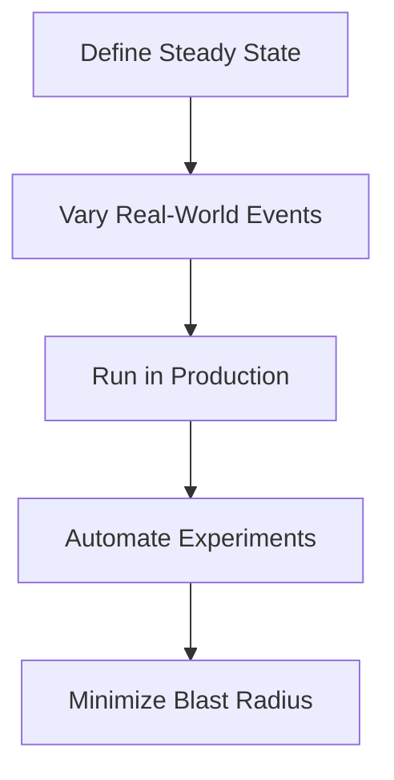
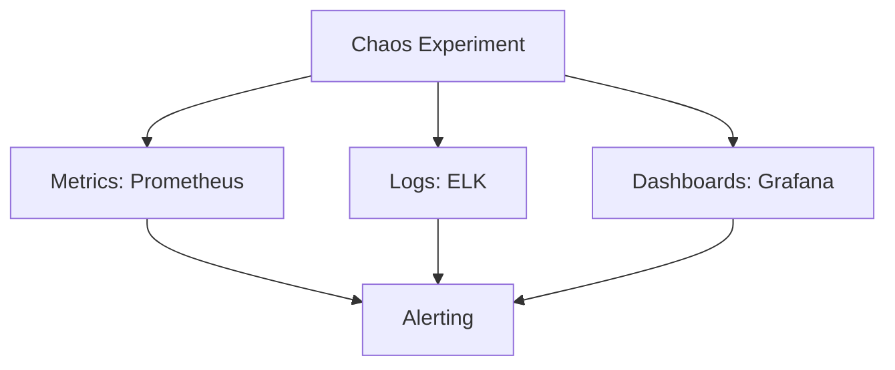
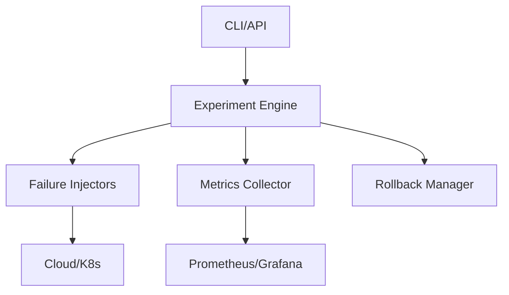

# Chaos Engineering: The Definitive Deep-Dive for Distributed Systems

## Introduction

Distributed systems are the backbone of modern digital infrastructure, powering everything from streaming platforms to global e-commerce. But with great scale comes great complexity—and unpredictability. How do you ensure your system can survive the unexpected? Enter **Chaos Engineering**: the discipline of intentionally injecting failure to learn, adapt, and build truly resilient systems.

In this guide, I’ll take you on a deep technical journey through chaos engineering. We’ll cover its origins, principles, methodologies, tools, and advanced concepts. You’ll see practical examples, code demonstrations, and real-world case studies. Whether you’re a seasoned SRE, a cloud architect, or a curious developer, this is your definitive reference for mastering chaos engineering.

---

## Why Chaos Engineering?

### Learning from Failure

Traditional testing can’t predict every possible failure in a distributed system. Chaos engineering flips the script: instead of fearing failure, we embrace it—on our own terms. By simulating outages, latency, and resource exhaustion, we learn how our systems behave under stress and how to make them stronger.

**Key Goals:**
- **Resilience:** Survive and recover from failures.
- **Reliability:** Deliver consistent service, even when things go wrong.
- **Continuous Learning:** Use failure as feedback for improvement.

### A Brief History

Chaos engineering was popularized by Netflix in the late 2000s. Their legendary "Chaos Monkey" tool randomly killed production instances to test system recovery. Today, chaos engineering is a global movement, with open-source tools, cloud-native platforms, and a vibrant community.

---

## Challenges in Distributed Systems

Distributed systems are complex, dynamic, and massive in scale. Let’s break down the three main challenges:

### 1. Complexity
- Multiple components interact in unpredictable ways.
- Emergent behaviors can lead to cascading failures.

### 2. Scale
- Thousands (or millions) of nodes, services, and dependencies.
- Testing every possible interaction is impossible.

### 3. Dynamicity
- Nodes join and leave frequently.
- The system’s topology and state are always changing.

#### Why Traditional Testing Falls Short
- **Unit and integration tests** cover known scenarios, not unknown unknowns.
- **Staging environments** rarely match production scale or diversity.
- **Manual failover drills** are infrequent and limited in scope.

**Real-World Failure Scenarios:**
- Network partitions
- Sudden traffic spikes
- Hardware failures
- Dependency outages
- Data corruption

---

## Principles of Chaos Engineering

Chaos engineering isn’t random destruction—it’s a disciplined, scientific approach. The five core principles are:

### 1. Define a Steady State Hypothesis
- Identify what "normal" looks like (e.g., 99.99% uptime, <200ms latency).
- Use metrics, SLIs, and dashboards to measure steady state.

### 2. Vary Real-World Events
- Simulate realistic failures: network latency, hardware crashes, dependency timeouts.
- Avoid synthetic, idealized scenarios.

### 3. Run Experiments in Production
- Test in the real environment, with real traffic and dependencies.
- Use canary releases and progressive rollouts to minimize risk.

### 4. Automate Experiments for Continuous Testing
- Integrate chaos into CI/CD pipelines.
- Use automation to run experiments regularly and consistently.

### 5. Minimize Blast Radius
- Limit the scope of experiments to reduce impact.
- Use isolation, rollback procedures, and monitoring to contain failures.

#### Diagram: Chaos Engineering Principles


---

## Chaos Engineering Methodology

Let’s walk through the step-by-step process of running a chaos experiment:

### 1. Hypothesis Generation
- What do you expect to happen if a failure occurs?
- Example: "If a database node fails, the system should reroute traffic and maintain availability."

### 2. Experimentation
- **Design:** Choose the failure scenario, scope, and metrics.
- **Execution:** Inject failure using tools (e.g., kill a VM, add latency).
- **Monitoring:** Track system behavior, collect logs and metrics.

### 3. Analysis and Improvement
- Compare results to the steady state hypothesis.
- Identify weaknesses, bottlenecks, and unexpected behaviors.
- Prioritize fixes and improvements.

### 4. Continuous Feedback Loop
- Repeat experiments regularly.
- Refine hypotheses and expand scenarios.
- Share learnings across teams.

#### Table: Chaos Experiment Lifecycle
| Step            | Description                                      |
|-----------------|--------------------------------------------------|
| Hypothesis      | Define expected system behavior                  |
| Experimentation | Inject failure, monitor system                   |
| Analysis        | Compare results, identify weaknesses             |
| Improvement     | Fix issues, update system                        |
| Feedback        | Repeat, refine, share learnings                  |

---

## Popular Chaos Engineering Tools and Platforms

### Netflix Simian Army
- **Chaos Monkey:** Randomly kills VM instances.
- **Latency Monkey:** Injects network latency.
- **Chaos Kong:** Simulates region-wide outages.
- **Janitor Monkey:** Cleans up unused resources.
- **Chaos Gorilla:** Simulates loss of an entire availability zone.

#### Example: Chaos Monkey Configuration
```json
{
  "enabled": true,
  "schedule": "business-hours",
  "target": "stateless-services",
  "region": "us-west-2"
}
```

### Open-Source Tools
- **Gremlin:** SaaS platform for chaos experiments (UI, API, integrations).
- **LitmusChaos:** Kubernetes-native chaos framework (CRDs, workflows).
- **Chaos Toolkit:** Extensible, Python-based chaos automation.
- **PowerfulSeal:** Kubernetes-focused, YAML-driven experiments.

#### Table: Tool Comparison
| Tool           | Platform      | Features                  | Integration         |
|----------------|--------------|---------------------------|---------------------|
| Chaos Monkey   | AWS/Cloud    | VM termination            | Netflix OSS         |
| Gremlin        | SaaS/Cloud   | UI, API, multi-failure    | CI/CD, cloud-native |
| LitmusChaos    | Kubernetes   | CRDs, workflows, UI       | K8s, Prometheus     |
| Chaos Toolkit  | Python       | Extensible, automation    | Any, Python         |
| PowerfulSeal   | Kubernetes   | Node/pod failure, YAML    | K8s, CLI            |

---

## Implementing Chaos Experiments

### Designing Safe Experiments
- **Scope:** Limit to non-critical services or test environments.
- **Blast Radius:** Use canary deployments, feature flags, and isolation.
- **Rollback:** Prepare scripts and procedures to revert changes.

#### Example 1: Killing a VM with Chaos Monkey
```bash
# Chaos Monkey CLI (pseudo-code)
chaos-monkey kill --target vm-12345 --region us-west-2
```

#### Example 2: Simulating Network Latency with Latency Monkey
```python
# Gremlin Python SDK example
import gremlin
client = gremlin.Client(auth_token="YOUR_TOKEN")
client.network.latency(
    target="service-a",
    delay_ms=500,
    duration="5m"
)
```

#### Example 3: Inducing Node Failures in Kubernetes with LitmusChaos
```yaml
apiVersion: litmuschaos.io/v1alpha1
kind: ChaosEngine
metadata:
  name: node-failure
spec:
  appinfo:
    appns: default
    applabel: "app=web"
    appkind: deployment
  chaosServiceAccount: litmus-admin
  experiments:
    - name: node-cpu-hog
      spec:
        components:
          env:
            - name: CPU_CORES
              value: "2"
```

### Monitoring and Observability
- Use metrics (Prometheus, Datadog), logs (ELK), and dashboards (Grafana).
- Track error rates, latency, throughput, and recovery times.

#### Diagram: Observability Stack for Chaos Experiments


---

## Advanced Chaos Engineering Concepts

### Running Experiments in Production vs. Staging
- **Production:** Real traffic, real dependencies, higher risk, higher value.
- **Staging:** Safer, but may miss real-world issues.
- **Best Practice:** Start in staging, graduate to production with canary releases.

### Automating Chaos in CI/CD Pipelines
- Integrate chaos experiments into build/test workflows.
- Use GitHub Actions, Jenkins, or GitLab CI to trigger chaos jobs.

#### Example: GitHub Actions for Chaos Experiment
```yaml
name: Chaos Test
on: [push]
jobs:
  chaos:
    runs-on: ubuntu-latest
    steps:
      - name: Run Chaos Toolkit
        run: chaos run experiment.json
```

### Canary Testing and Progressive Rollouts
- Deploy changes to a small subset of users/services.
- Monitor impact before full rollout.

### Failure Injection Patterns
- **Network:** Latency, packet loss, partitions.
- **Hardware:** CPU/memory exhaustion, disk failure.
- **Application:** Crash, exception, resource leak.
- **Dependency:** Third-party outage, API throttling.

### Statistical Analysis of Experiment Results
- Use statistical models to analyze recovery times, error rates, and impact.
- Identify patterns and correlations in failure scenarios.

#### Table: Failure Injection Patterns
| Pattern      | Example Scenario           | Tool/Method         |
|--------------|---------------------------|---------------------|
| Network      | 500ms latency, partition  | Gremlin, LitmusChaos|
| Hardware     | CPU hog, disk failure     | LitmusChaos, K8s    |
| Application  | Crash, memory leak        | Chaos Toolkit       |
| Dependency   | API outage, throttling    | Gremlin, custom     |

---

## Case Studies and Real-World Applications

### Netflix: Evolution of Chaos Engineering
- Started with Chaos Monkey in 2008.
- Expanded to Simian Army (multiple tools).
- Lessons learned: automate, minimize blast radius, share learnings.

### Amazon, Google, LinkedIn
- Amazon: "GameDays"—team-based failure drills.
- Google: SREs use failure injection for reliability.
- LinkedIn: Chaos engineering for Kafka and data pipelines.

### Open-Source Project Case Studies
- **Kubernetes:** LitmusChaos, PowerfulSeal for pod/node failures.
- **Cassandra:** Simulate node loss, network partitions.
- **Zookeeper:** Test quorum loss, leader election under stress.

#### Anecdote: Netflix’s Chaos Kong
Netflix simulated the loss of an entire AWS region to test global failover. The experiment revealed gaps in data replication and led to major improvements in disaster recovery.

---

## Best Practices and Common Pitfalls

### Planning and Communication
- Involve all stakeholders: SREs, developers, product owners.
- Communicate experiment scope, goals, and rollback plans.

### Minimizing Risk and Blast Radius
- Start small, expand gradually.
- Use canary deployments and feature flags.

### Handling Stateful vs. Stateless Services
- **Stateless:** Easier to experiment, less risk.
- **Stateful:** Higher risk, require careful planning and backup.

### Avoiding Uncontrolled Outages
- Always have rollback procedures.
- Monitor closely, alert on anomalies.

### Continuous Improvement and Learning
- Document findings, share across teams.
- Use post-mortems to drive improvement.

#### Callout: Common Pitfalls
- Running experiments without clear hypotheses.
- Failing to monitor or alert on failures.
- Overlooking dependencies and cascading effects.
- Neglecting documentation and communication.

---

## Troubleshooting and Recovery

### Rollback Strategies
- Automated scripts to revert changes.
- Manual intervention plans for critical failures.

### Incident Response During Chaos Experiments
- On-call teams ready to respond.
- Clear escalation paths and communication channels.

### Post-Mortem Analysis and Documentation
- Analyze what happened, why, and how to improve.
- Share learnings in blameless post-mortems.

#### Example: Post-Mortem Template
```markdown
# Chaos Experiment Post-Mortem
## Summary
## Timeline
## Impact
## Root Cause
## Recovery Steps
## Lessons Learned
## Action Items
```

---

## Building Your Own Chaos Engineering Tool

### Principles for Custom Tool Development
- Modular, extensible architecture.
- Integration with existing infrastructure (cloud, K8s, CI/CD).
- Support for multiple failure scenarios.

### Example Architecture


### Code Snippet: Custom Failure Injector (Python)
```python
import subprocess

def kill_process(pid):
    try:
        subprocess.run(["kill", "-9", str(pid)], check=True)
        print(f"Process {pid} killed successfully.")
    except Exception as e:
        print(f"Error killing process: {e}")
```

### Extensibility and Integration
- Use plugins for new failure types.
- Integrate with monitoring and alerting platforms.
- Support REST APIs and CLI for automation.

---

## Conclusion and Further Reading

Chaos engineering is more than breaking things—it’s about building confidence in your system’s ability to survive the unexpected. By embracing failure, running disciplined experiments, and sharing learnings, you can create systems that are truly resilient and reliable.

**Key Takeaways:**
- Chaos engineering is a scientific, iterative process.
- Use automation, monitoring, and communication to minimize risk.
- Learn from real-world failures and continuously improve.

**Recommended Resources:**
- "Chaos Engineering: Building Confidence in System Behavior through Experiments" (O’Reilly)
- Netflix Tech Blog: Chaos Monkey, Simian Army
- Gremlin Blog and Documentation
- LitmusChaos Documentation
- PrinciplesOfChaos.org

**Future Trends:**
- Chaos engineering for serverless and edge computing
- AI-driven failure scenario generation
- Deeper integration with observability and incident response platforms

---

## Appendix: Full Example - Chaos Experiment in Kubernetes

### Step 1: Define Steady State
- Service latency < 200ms
- Error rate < 0.1%

### Step 2: Design Experiment
- Inject CPU hog on one node for 5 minutes

### Step 3: Execute Experiment
```yaml
apiVersion: litmuschaos.io/v1alpha1
kind: ChaosEngine
metadata:
  name: cpu-hog
spec:
  appinfo:
    appns: default
    applabel: "app=web"
    appkind: deployment
  chaosServiceAccount: litmus-admin
  experiments:
    - name: pod-cpu-hog
      spec:
        components:
          env:
            - name: CPU_CORES
              value: "2"
```

### Step 4: Monitor and Analyze
- Use Prometheus and Grafana to track latency and error rate.
- Compare to steady state hypothesis.

### Step 5: Rollback and Document
- Stop experiment, restore node.
- Document findings in post-mortem.

---

Chaos engineering is a journey, not a destination. Start small, learn continuously, and build systems that thrive in the face of chaos!
