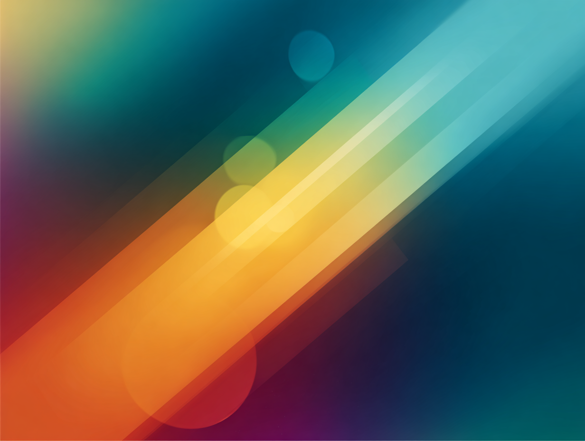
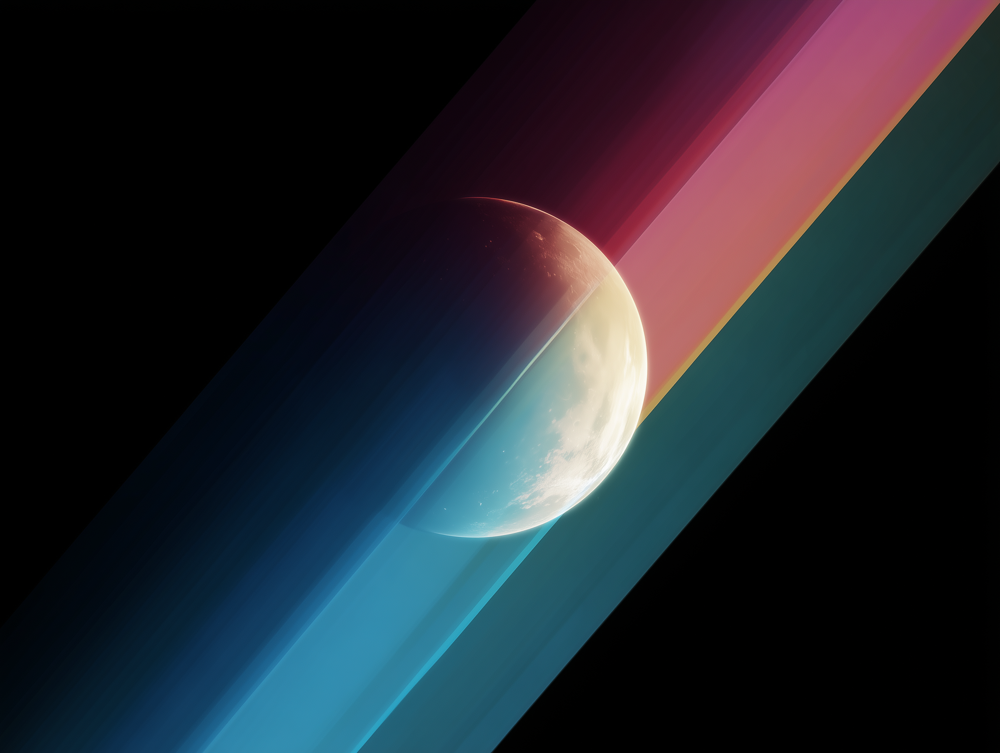
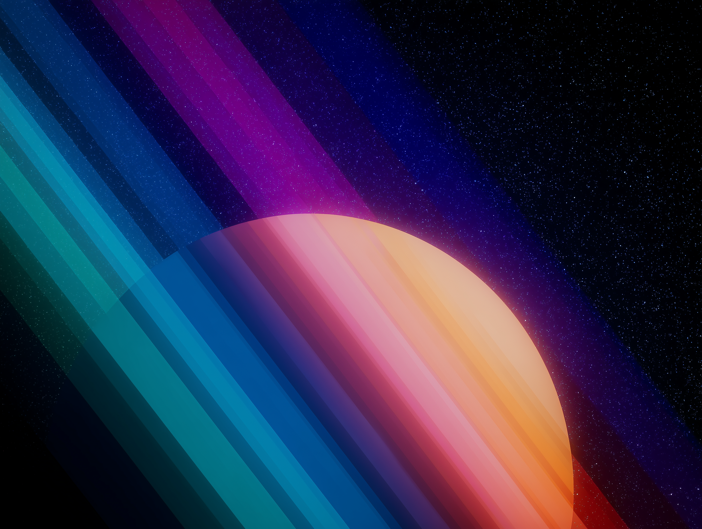
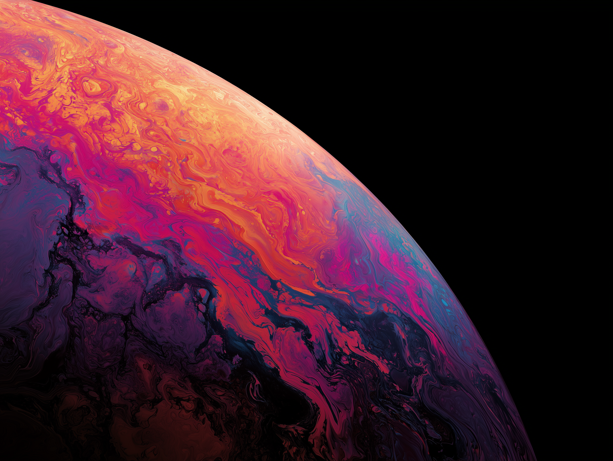

import WallpaperShowcase from '../components/wallpaperShowcase/wallpaperShowcase.jsx';
import wallpaper1 from './basicUbuntuGuy1-desk.png';
import wallpaper1Tablet from './basicUbuntuGuy1-tablet.png';
import wallpaper1Mobile from './basicUbuntuGuy1-mobile.png';
import wallpaper2 from './basicUbuntuGuy2-desk.png';
import wallpaper2Tablet from './basicUbuntuGuy2-tablet.png';
import wallpaper2Mobile from './basicUbuntuGuy2-mobile.png';
import wallpaper3 from './basicUbuntuGuy3-desk.png';
import wallpaper3Tablet from './basicUbuntuGuy3-tablet.png';
import wallpaper3Mobile from './basicUbuntuGuy3-mobile.png';
import wallpaper4 from './basicUbuntuGuy4-desk.png';
import wallpaper4Tablet from './basicUbuntuGuy4-tablet.png';
import wallpaper4Mobile from './basicUbuntuGuy4-mobile.png';

## Basic Ubuntu Guy - Volume 1

Hello for quite some time I have used this website to get my beautiful
wallpapers for my devices, https://basicappleguy.com/, which I can highly
recommend, (most probably way better than what you will find here). However I
love my space stuff so I have decided to give it a go, so without further ado,
here is my first collection of wallpapers, for desktop, mobile and tablet.

click on the images to download the full resolution version.

<WallpaperShowcase
  desktop={wallpaper1}
  tablet={wallpaper1Tablet}
  mobile={wallpaper1Mobile}
/>

click on the images to download the full resolution version.

click on the images to download the full resolution version. (desktop, tablet,
mobile)

<WallpaperShowcase
  desktop={wallpaper2}
  tablet={wallpaper2Tablet}
  mobile={wallpaper2Mobile}
/>

click on the images to download the full resolution version. (desktop, tablet,
mobile)

<WallpaperShowcase
  desktop={wallpaper3}
  tablet={wallpaper3Tablet}
  mobile={wallpaper3Mobile}
/>

click on the images to download the full resolution version. (desktop, tablet,
mobile)

<WallpaperShowcase
  desktop={wallpaper4}
  tablet={wallpaper4Tablet}
  mobile={wallpaper4Mobile}
/>

### Fun fact

The majority of tablet users tend to use their devices in landscape orientation,
particularly for larger tablets. For full-size tablets (over 9 inches),
landscape usage is dominant, with iPad Pro users using portrait orientation only
27% of the time. A survey of 155 tablet users found that 72% of 10-inch tablet
users preferred landscape orientation, a trend observed across both iPad and
Android devices. This preference is attributed to the larger screen size making
landscape mode more comfortable for tasks like watching videos, using keyboards,
and browsing, which are often more naturally suited to a wider display. While
smaller tablets (7-9 inches) show more balanced usage, with 72% of 7-inch tablet
users preferring portrait orientation, the overall trend for tablets, especially
larger ones, favors landscape.

https://thomaspark.co/2011/10/in-portrait-or-landscape/
