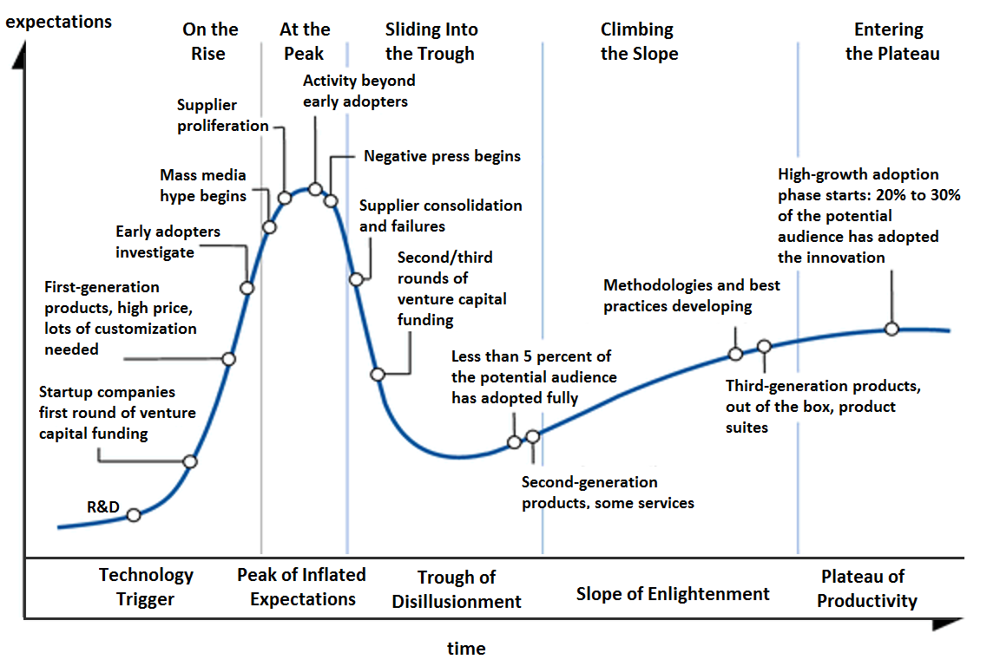

# Beware of the Hype Train

## Introduction

Every year, the tech world is swept up by a new wave of excitement. A framework, a language, or a tool emerges, promising to revolutionize how we build software. The blogs light up, Twitter explodes, and suddenly everyone is talking about the Next Big Thing. But as any seasoned developer or architect knows, riding the hype train can be exhilarating—and dangerous. In this post, I’ll take you on a deep technical journey through the risks and realities of investing in hyped-up technologies and frameworks, drawing on the Gartner Hype Cycle, real-world case studies, and advanced concepts like Product Lifecycle Management (PLM) and technical debt. If you’re a developer, team lead, or CTO, this is your definitive guide to surviving—and thriving—amidst the hype.

## Historical Context & The Hype Cycle

### The Origin of the Hype Cycle

The Gartner Hype Cycle, introduced in 1995 by analyst Jackie Fenn, is a graphical representation of the maturity, adoption, and social application of specific technologies. It’s become a staple in tech strategy discussions, mapping the journey from wild optimism to sobering reality and, hopefully, eventual productivity. The five phases are:

1. **Technology Trigger**: A breakthrough or innovation sparks interest. Proof-of-concept stories and media buzz abound, but usable products are rare.
2. **Peak of Inflated Expectations**: Success stories (and failures) multiply. Some companies jump in; most watch from the sidelines.
3. **Trough of Disillusionment**: Reality sets in. Early experiments fail, vendors drop out, and only the strongest survive.
4. **Slope of Enlightenment**: The technology’s real benefits become clear. Second- and third-generation products appear, and cautious enterprises start pilots.
5. **Plateau of Productivity**: Mainstream adoption takes off. The technology proves its worth and becomes a staple—if it survives.


By Olga Tarkovskiy - Own work, CC BY-SA 3.0, https://commons.wikimedia.org/w/index.php?curid=27546041


#### Criticisms and Limitations

Despite its popularity, the Hype Cycle is not without flaws. Critics argue it’s not scientific, lacks actionable guidance, and doesn’t always match real-world adoption. The Economist’s 2024 research found that only about a fifth of breakthrough technologies follow the full cycle; most either become widely used without drama or fade away after the initial excitement. Still, the Hype Cycle remains a useful lens for understanding tech trends—and their risks.

#### Real-World Examples

- **Blockchain**: Once hailed as the future of everything, blockchain has seen countless failed projects and pivots. While some applications (like cryptocurrencies) have matured, many others remain stuck in the trough.
- **JavaScript Frameworks**: From AngularJS to Svelte, the frontend world is littered with frameworks that soared on hype, only to be replaced or radically rewritten.
- **NoSQL Databases**: Promised to replace relational databases, but only a handful (MongoDB, Cassandra) reached the plateau; many others faded away.

## Risks of Investing in Hyped Technologies

### The Dangers of 0.x Releases, and fast changing API's 

One of the first red flags when evaluating a new technology is its version number. Anything below 1.0.0 is, by definition, experimental. APIs change, features are added or removed, and breaking changes are the norm. Investing heavily in a 0.x framework is like building a house on shifting sand.

#### Example: Breaking Changes in Early Frameworks

This is one is one of my most painfull expierences, i am still stuck on the v2 of gatsby, take a look at some of these migrations needed to update from gatsby v2 to v3, it's not just a matter of changing the version number, you need to rewrite a lot of code. Link to the actual migration guide [here](https://www.gatsbyjs.com/docs/reference/release-notes/migrating-from-v2-to-v3/).

The gatsby framework has moved on to v5, imo very fast paced proggression, one of many reasons its not longer so popular and forgotten by many. 

```js
import React from "react"
- import { navigateTo, push, replace } from "gatsby"
+ import { navigate } from "gatsby"
const Form = () => (
  <form
    onSubmit={event => {
      event.preventDefault()
-     navigateTo("/form-submitted/") // or push() or replace()
+     navigate("/form-submitted/")
    }}
  >
)

```

gatsby-config.js

```js
module.exports = {
- __experimentalThemes: ["gatsby-theme-blog"]
+ plugins: ["gatsby-theme-blog"]
}

```
Removal of pathContext
The deprecated API pathContext was removed. You need to rename instances of it to pageContext. For example, if you passed information inside your gatsby-node.js and accessed it in your page:

```js
src/templates/context.jsx
import React from "react"

- const ContextPage = ({ pathContext }) => (
+ const ContextPage = ({ pageContext }) => (
  <main>
    <h1>Hello from a page that uses the old pathContext</h1>
    <p>It was deprecated in favor of pageContext</p>
-   <p>{pathContext.foo}</p>
+   <p>{pageContext.foo}</p>
  </main>
)

export default ContextPage

```
Removal of boundActionCreators
The deprecated API boundActionCreators was removed. Please rename its instances to actions to keep the same behavior. For example, in your gatsby-node.js file:

gatsby-node.js
```js
Copygatsby-node.js: copy code to clipboard
exports.createPages = (gatsbyArgs, pluginArgs) => {
- const { boundActionCreators } = gatsbyArgs
+ const { actions } = gatsbyArgs
}

```
Removal of deleteNodes
The deprecated API deleteNodes was removed. Please iterate over the nodes instead and call deleteNode:

```js
const nodes = ["an-array-of-nodes"]
- deleteNodes(nodes)
+ nodes.forEach(node => deleteNode(node))
```

Removal of fieldName & fieldValue from createNodeField
The arguments fieldName and fieldValue were removed from the createNodeField API. Please use name and value instead.

```js
exports.onCreateNode = ({ node, actions }) => {
  const { createNodeField } = actions
  createNodeField({
    node,
-   fieldName: "slug",
-   fieldValue: "my-custom-slug",
+   name: "slug",
+   value: "my-custom-slug",
  })
}
```
Removal of hasNodeChanged from public API surface
This API is no longer necessary, as there is an internal check for whether or not a node has changed.

Removal of sizes & resolutions for image queries
The sizes and resolutions queries were deprecated in v2 in favor of fluid and fixed.

While fluid, fixed, and gatsby-image will continue to work in v3, we highly recommend migrating to the new gatsby-plugin-image. Read the Migrating from gatsby-image to gatsby-plugin-image guide to learn more about its benefits and how to use it.

```js
import React from "react"
import { graphql } from "gatsby"
import Img from "gatsby-image"

const Example = ({ data }) => {
  <div>
-    
-    
+    
+    
  </div>
}

export default Example

export const pageQuery = graphql`
  query IndexQuery {
    foo: file(relativePath: { regex: "/foo.jpg/" }) {
      childImageSharp {
-        sizes(maxWidth: 700) {
-          ...GatsbyImageSharpSizes
+        fluid(maxWidth: 700) {
+          ...GatsbyImageSharpFluid
        }
      }
    }
    bar: file(relativePath: { regex: "/bar.jpg/" }) {
      childImageSharp {
-        resolutions(width: 500) {
-          ...GatsbyImageSharpResolutions_withWebp
+        fixed(width: 500) {
+          ...GatsbyImageSharpFixed_withWebp
        }
      }
    }
  }
`
```

Thats not all the chagnes needed to update to the new gatsby version, the list goes on and on, but you get the idea.

Migrating codebases is painful, especially under business pressure. If you’re not planning for refactoring from day one, you’re setting yourself up for failure.

### Solo-Maintainer Risks and Open Source Sustainability

Open source is a double-edged sword. While community-driven projects can be robust, those maintained by a single developer are risky. Solo maintainers may lose interest, lack resources, or simply disappear. Without a healthy contributor base, features stagnate, bugs linger, and backward compatibility is often ignored.

#### Example: Abandoned Packages

Consider the fate of many npm packages. A solo developer creates a useful tool, it gains traction, but as demands grow, the maintainer burns out. Suddenly, your project depends on an unmaintained package, and you’re left scrambling for alternatives.

### Business Pressures vs. Developer Experience

In most organizations, business owners care about features, not developer experience. The pressure to deliver “just one more feature” often overrides the need for refactoring or technical debt management. If you don’t carve out time for refactoring in your sprints, “later” never comes. As a team lead or architect, it’s your responsibility to build strong foundations and advocate for sustainable practices.

## Case Studies & Real-World Examples

### Stuck in the Trough: The AngularJS Saga

AngularJS was once the darling of frontend development. But as its limitations became clear, Google released Angular (v2+), a complete rewrite. The migration path was so painful that many teams abandoned Angular altogether, switching to React or Vue. Those who stuck with AngularJS faced mounting technical debt and dwindling community support.

#### Code Example: AngularJS to Angular Migration

```js
// AngularJS controller
app.controller('MainCtrl', function($scope) {
  $scope.message = 'Hello, world!';
});

// Angular (v2+)
@Component({
  selector: 'app-main',
  template: `<h1>{{ message }}</h1>`
})
export class MainComponent {
  message = 'Hello, world!';
}
```

The architectural shift required a complete rewrite, not just a refactor. Many businesses underestimated the cost and impact.

### The v2, v3, v4 Rewrite Trap

If you don’t address foundational issues during a rewrite, you’ll soon be talking about v3, v4, and beyond. Each rewrite brings more pain, more technical debt, and more resistance from stakeholders.

#### Example: Breaking Changes in Svelte

Svelte’s early versions saw significant API changes. Teams that adopted Svelte at v1 or v2 faced major rewrites as the framework matured. Only those who waited for stability (v3+) avoided the churn.

### Open Source Sustainability Analysis

Let’s analyze the health of a popular open source project using a simple script:

```js
// Check contributor count and issue activity
const fetch = require('node-fetch');

async function checkRepoHealth(repo) {
  const res = await fetch(`https://api.github.com/repos/${repo}`);
  const data = await res.json();
  console.log(`Stars: ${data.stargazers_count}`);
  console.log(`Open Issues: ${data.open_issues_count}`);
  console.log(`Forks: ${data.forks_count}`);
}

checkRepoHealth('facebook/react');
```

A healthy project has many contributors, active issue resolution, and regular releases. Solo-maintainer projects often lack these signals.

## Product Lifecycle Management (PLM) and Technology Adoption

### PLM Principles in Software

PLM isn’t just for hardware. In software, it means managing the entire lifecycle: conception, design, realization, service, and disposal. Applying PLM principles helps teams avoid the pitfalls of hype-driven adoption.

#### Lifecycle Stages

1. **Conceive**: Define requirements, evaluate risks, and plan for long-term viability.
2. **Design**: Develop prototypes, test concepts, and validate assumptions.
3. **Realize**: Build, deploy, and deliver the product. Plan for maintenance and upgrades.
4. **Service**: Support, maintain, and eventually retire the product.

### Integration with Business Processes

PLM requires cross-functional collaboration. Marketing, engineering, and support must work together to ensure the product’s success. In software, this means integrating project management, CI/CD pipelines, and customer feedback loops.

#### Example: PLM Workflow in Software

- **Specification**: Gather requirements from stakeholders.
- **Design Freeze**: Lock down architecture before implementation.
- **Launch**: Deploy to production, monitor performance.
- **Service**: Provide updates, fix bugs, and plan for end-of-life.

## Best Practices for Technology Selection

### Evaluating Maturity and Community Health

Before adopting a new technology, ask:

- Is it at v1.0.0 or higher?
- How active is the community?
- Are there regular releases and clear deprecation policies?
- Is the documentation comprehensive?
- Are there multiple maintainers or a single point of failure?

#### Example: Framework Evaluation Checklist

```markdown
- [x] Stable release (v1.0.0+)
- [x] Active contributors (10+)
- [x] Regular releases (monthly/quarterly)
- [x] Comprehensive documentation
- [x] Clear migration guides
- [x] Backward compatibility guarantees
```

### Building in Time for Refactoring and Technical Debt Management

**Refactoring isn’t optional—it’s essential.** Include refactoring in your sprints, make sure you always give your self time for proper code maintenance, "later" never comes. You will always have to pay for it later or simply your project will be dropped as your mighty "velocity" drops. It's devloper and architect reposibility to write and maintain clean code. Your business overlords do not care about the code, they only care about the features.

#### Example: Technical Debt Tracking

Use tools like SonarQube or CodeClimate to quantify technical debt. Set thresholds and enforce them in your CI/CD pipeline.

```yaml
# Example: SonarQube Quality Gate
qualityGate:
  conditions:
    - metric: 'code_smells'
      operator: '<'
      value: 100
    - metric: 'duplicated_lines_density'
      operator: '<'
      value: 5
```

### Investing in Solid Teams and Well-Supported Projects

A strong team is your best defense against hype-driven failure. Invest in training, encourage open source contributions, and choose projects with robust governance.

## Common Pitfalls & How to Avoid Them

### Feature-Driven Development Traps

Focusing solely on features leads to brittle codebases and mounting technical debt. Balance feature development with refactoring and architectural improvements.

### Ignoring Refactoring Needs

If you postpone refactoring, you’ll never get to it. Make it a first-class citizen in your development process.

### Underestimating the Cost of Technical Debt

Technical debt compounds over time. Track it, manage it, and pay it down regularly.

#### Example: Refactoring Pain Points, plan for the future, not just the present.

A simple change in a codebase and approach could mean life and death of your project. 

```js
// Legacy code with tight coupling
function processOrder(order) {
  // ...
  paymentGateway.charge(order.amount);
  // ...
}

// Refactored for testability
function processOrder(order, paymentGateway) {
  // ...
  paymentGateway.charge(order.amount);
  // ...
}
```

Decoupling dependencies makes future changes easier and reduces risk.

## Advanced Concepts

### Quantifying Technical Debt

Technical debt isn’t just a metaphor—it can be measured. Use static analysis tools, code metrics, and regular audits to quantify debt and prioritize remediation.

#### Example: Cyclomatic Complexity

```js
function calculate(a, b, op) {
  if (op === '+') return a + b;
  else if (op === '-') return a - b;
  else if (op === '*') return a * b;
  else if (op === '/') return a / b;
  else throw new Error('Unknown operator');
}
```

High cyclomatic complexity signals code that’s hard to test and maintain. Refactor to reduce complexity.

### Organizational Strategies for Sustainable Tech Adoption

- **Concurrent Engineering**: Work in parallel across teams to reduce lead times and improve communication.
- **Role-Specific UIs**: Tailor tools to user expertise to improve adoption and reduce errors.
- **Change Management**: Prepare stakeholders for the realities of tech adoption, including refactoring and migration costs.

### PLM Integration and Concurrent Engineering Workflows

Integrate PLM tools with your development workflow. Use collaborative platforms (e.g., Jira, Confluence, GitHub) to manage requirements, track changes, and coordinate releases.

#### Example: PLM-Driven Release Management

- **Kickoff**: Define goals and stakeholders.
- **Design Freeze**: Lock architecture and APIs.
- **Launch**: Deploy and monitor.
- **Service**: Maintain, support, and plan for end-of-life.

## Conclusion

The hype train is seductive, but it’s fraught with risk. **By understanding the Hype Cycle, applying PLM principles, and investing in solid teams and mature technologies, you can avoid the pitfalls of hype-driven adoption.** Track technical debt, prioritize refactoring, and build for the long term. 

**Remember: any project that cannot be modified will not be modified.** Don’t let your next big idea become the next big rewrite. Stay vigilant, stay pragmatic, and beware of the hype train.

---

**Actionable Advice:**
- Evaluate new technologies critically—don’t be swayed by hype alone.
- Invest in mature, well-supported frameworks and teams.
- Make refactoring and technical debt management a priority.
- Use PLM principles to guide technology adoption and lifecycle management.
- Always plan for change—because change is inevitable.
